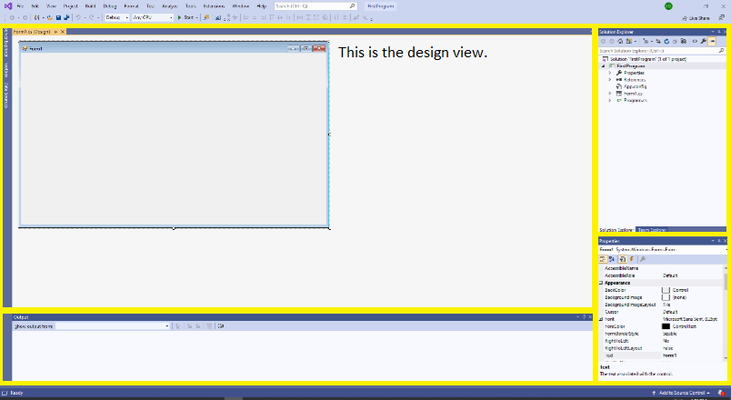
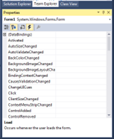
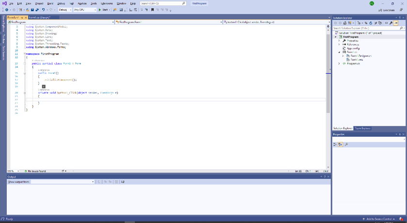
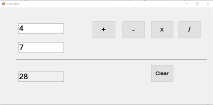
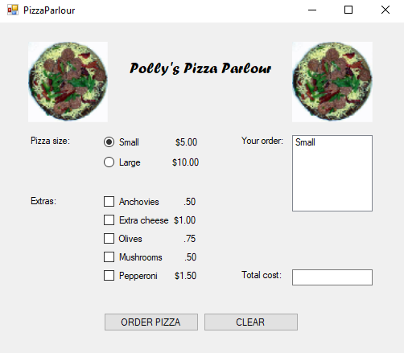

# 03: Windows Forms Application

The **Microsoft Visual Studio IDE** (integrated development environment) is made up of several tools that are used to build **GUI** (Graphical User Interface) applications – those with windows, buttons menus, graphics, etc., by dragging and dropping these pre-built controls onto an existing form as we want it to appear. We build applications that will respond to events – when the user clicks on a button, when a form is closed, etc. **Visual Studio** fills in all the necessary code for how to make these events happen when it compiles our application. We concentrate on writing the code to describe what should happen when the user clicks on a button, selects a menu-item, closes a window, and so on. We don't have to worry about all the complex operating system programming underneath – **Visual Studio** takes care of that for us.

## Creating a Windows Forms App

1. Open **Visual Studio**
2. Select **Create a new project**
3. Select **Windows Forms App (.NET Framework)**
4. Click **Next**
5. Fill in the following fields:
   - **Project name:** `03FormativeAssessment`
   - **Location:** `<path-to-repository>`
   - **Solution name:** `03FormativeAssessment`

Ensure that these four panes are visible on your screen. Note they are all moveable.



The main part is named `Form1.cs (Design)`. This is where, at design time, you create the **GUI**; it is used as a drawing canvas to resize the main form, add the buttons, labels etc that you will use in your application. This will be the main window that the user sees when your application is run. Your application can contain multiple windows (or **Forms**) that are displayed in response to user input, data values, etc. To start with, we will build projects that have only one `Form`.

## Adding Controls

Open View/Toolbox/Common Controls.

1. Add two `Buttons`, a `TextBox`, a `PictureBox` and a `Label` to the `Form`.
2. Run the application. Click on one of the `Buttons`, write in the `TextBox`. What happens?
3. Change the **size**, **text** and **name** of each of your `Buttons`.
4. Change the text, font and visibility of the `Label`.
5. Add an image to the `PictureBox`. How can you resize the image?
6. Change the colour of the `Form`.

## Design-Time or Run-Time?

We said earlier that `TextBoxes` could be used to show messages to the user of your application. For this to be useful, you need to be able to change the `Text` property while the application is running, when you won't be able to get at the **Properties** list. Changing a property while you are creating your application is called _"modifying at design-time"_. Changing the property from within the application while the application is running is called _"modifying at run-time"_.

Modifying at run-time is very easy: you simply write an assignment statement to assign a new value to the property. To refer to an object's property at run-time you use _"dot notation"_, which you have seen before when referring to elements of records at runtime. For example, to assign the text _"Here is my new text"_ to your `TextBox`, you put this statement in your code:

```cs
textBox1.Text  = "Here is my new text";
```

Assume you have three controls `button1`, `label1` and `textBox1` on your `Form`. What will be the effect of each of these statements at run-time?

1. `button1.Width = 400;`
2. `label1.Visible = false;`
3. `textBox1.Text  = "Go Otago";`
4. `button1.Text = label1.Text;`

## Responding to Events

We have seen that controls have **Properties**. But there is also a tab for **Events**, the lightning bolt in the **Properties** window.



If you select a `Button` on your `Form`, and click on the **Events** tab, it will look like this:


This is a list of all the **Events** – things the user can do (or the application can do) – that the `Button` control understands. For each of these events, you can specify some **C#** code that should be executed if the event occurs. For example, the `Button` understands the `Click` event. Whatever code you assign to that event (we'll see how to do this in a moment), will be executed when the user clicks on the `Button`. The `Button` also has a `MouseHover` event. This event occurs when the user passes the mouse over the `Button`. The `DragDrop` event occurs when the user drags the `Button` on the screen. And so forth.

Until you write code for any event, nothing happens when the event occurs. For example, if you haven't assigned any code to the `Click` event, the user can click on the `Button` as much as he likes, and it has no effect. You saw this happen above.

The code that you assign to an event is called an Event Handler. The code you assign to the `Click` event is called the `button1_Click` handler. Each event handler is simply a **C#** method. The code for your event handler goes in the `Form1.cs`.

Imagine that you have several `Buttons` on your `Form`, and you want different things to happen when you click each `Button`. A separate `Click` handler is associated with each `Button`, enforced by the naming convention of event handlers.

For example, if my `Form` is named `Form1`, and my `Button` is named `button1`, then the code that I want to execute when the user clicks on `button1` should be in a method called

```cs
private void button1_Click(object sender, EventArgs e) { ... }
```

Fortunately, you don't have to worry about typing out these complicated method names, because **C#** will do it for you. If you double-click in the space beside any event on the Events page, three things happen:

- The correct method name is entered into that space.
- You are automatically moved from the Form into the code.
- **C#** creates a skeleton for your event handler with the correct method name, and curly brackets, and places the cursor after the first curly bracket, ready for you to start typing your code.

It can be confusing to find yourself suddenly looking at the code instead of the `Form`. Don't be alarmed. This is the same thing that occurs when you toggle between the two views – **C#** has just done it for you.

## Responding to Events

1. Place a `Button` and a `Label` on the `Form`.
2. Select the `Button`. Select the Events tab. Double-click on the space beside **Click**. You'll see this:



Enter some code for the `Button` to execute. For example, when the `button1` is clicked, the caption property of the `Label` is changed. Here is one possibility:

```cs
label1.Text = "My text has changed";
```

Run your application and click on the `Button` to see the `Label` change.

3. Add a `Textbox` to your `Form`. Set it `Text` property to 0. Create a variable `nClicks`, The `Click` handler for a `Button` is shown below. What would be the effect of clicking on this `Button` ten times?

```cs
private void button1_Click(object sender, EventArgs e)
{
   int nClicks = Convert.ToInt16(textBox1.Text);
   nClicks = nClicks + 1; // or nClicks++; or nClicks += 1;
   textBox1.Text = Convert.ToString(nClicks);
}
```

**Notes:**

- You can not write the method definition for the `button1_Click` handler yourself. You must let **Visual Studio** do it for you.
- The `Convert.ToInt16(n)` function translates the parameter value n into its 16 bit integer representation. Thus `Convert.ToInt16(5)` converts the string "5" into the integer value 5.

Similarly the `Convert.ToString()` method converts from integer to the equivalent string representation. The `Convert.ToString` method could also be replaced by the `.ToString()` method. For example,

```cs
textBox1.Text = nClicks.ToString();
```

4. Add a `TextBox` to your `Form`. As we saw earlier, the contents of a `TextBox` can be changed while the application is running. Modify your `button1_Click` handler, so that when the `button1` is clicked, the caption of the `label1` changes to whatever is in `textBox1`. Run the application and change the `Label` several times by modifying what is in `textBox1`, then clicking the `button1`.

## TextBox and ListBox Controls

We used a single-lined `TextBox` to read and write text. A `TextBox` can be also be multi-lined, selected from the drop down box at the top right corner of the `TextBox` control.

Each control has its own set of properties, events and methods, events. We used the `TextBox` control's properties (e.g. Width) and control Events (e.g. Click). There is a third part to the interface of a control: its methods. Methods are commands that the control understands. You use these commands when writing event handlers for the control. For example, `TextBox` controls have a method called `Clear()`. This method tells a `TextBox` to erase all the text it contains. To invoke a method, you use the same dot notation that you used for properties. Thus, the statement `textBox1.Clear();` will erase all the text in a `TextBox` named `textBox1`. To add text to a `TextBox`, use the `AppendText(s)` method, where the parameters is the string that is to be added to the `TextBox`.

A ListBox is another control for reading and writing text. It is multi-lined by definition.

One of the things that makes **C#** so powerful is that a control's properties can themselves be complex objects that have their own methods, events and sub-properties. For example, a `ListBox` contains a property called `Items`, which stores the text contents of the `ListBox` (just as the `Width` property of a `Button` stores the `Width` of the `Button`). The `Items` property is itself a complex data object with methods and properties. For example, `Items` has a method called `Clear()` to clear all items in the `ListBox`. It also has a method called `Add()`, which adds a new line of text to `Items` (and thus to the `ListBox`). To call a sub-method like `Add()`, just extend the dot notation in the logical way, adding the method name after the property name. For example, the following statement puts the string "This is a new line of text” after the current contents of the `ListBox` called `listBox1`:

```cs
listBox1.Items.Add("This is new line of text");
```

The `Items` property also has properties of its own. For example, `Items` has a property `Count`, which stores the number of lines of text the `Items` property contains (this is of course equal to the number of lines of text in the `ListBox`).

```cs
listBox1.Items.Count;
```

Note that you do not need to know how the `Clear()` method, the `Lines` property, the `Add()` method or the `Count` property are implemented. You only need to know how to use them. For example, you must know that the `Add()` method requires a string parameter, and that `Count` property is an integer value. You need to know the interface, but not the implementation.

## Radio Button Controls

**C#** provides two familiar user interface elements that can be used to collect user input to determine branching conditions. They are `RadioButtons` and `CheckBoxes`.

`RadioButtons` are yes/no (or on/off) controls that occur in mutually exclusive sets. That is, only one member of a set of radio buttons can be selected (on) at a time. Selecting any member of a set of radio buttons causes all the other members to be deselected.

If you place a number of radio buttons directly on the `Form`, they are automatically members of a mutually exclusive set (i.e. only one of them can be selected at a time). If you want more than one set of radio buttons, you must place each set in a separate container. **C#** provides two types of containers. They can be used to group any **C#** controls, but are most frequently used to define a set of `RadioButtons`. They are a `GroupBox` and a `Panel`. You must manually place each button on the container, and must manually change the caption of each button.

## Data Grid View Control

The `DataGridView` control is a new control that replaces the `DataGrid` control. The `DataGridView` control provides a powerful and flexible way to display data in a tabular format. You can use the `DataGridView` control to show read-only views of a small amount of data, or you can scale it to show editable views of very large sets of data. The `DataGridView` control supports the standard Windows Forms data binding model, so it can bind to a variety of data sources.

```cs
public partial class Form1 : Form
{
   private List<string>? _names;

   public Form1()
   {
      InitializeComponent();

      _names = new() { "John", "Mary", "Bob", "Jane" };

      dataGridView1.Columns.Add("Name", "Name");

      foreach (string name in _names)
      {
         int rowIdx = dataGridView1.Rows.Add();
         dataGridView1.Rows[rowIdx].Cells["Name"].Value = name;
      }
   }
}
```

# Formative Assessment

Before you start, create a new **Windows Forms Application** called **03-formative-assessment**.

If you get stuck on any of the following tasks, feel free to use **ChatGPT** permitting, you are aware of the following:

- If you provide **ChatGPT** with a prompt that is not refined enough, it may generate a not-so-useful response
- Do not trust **ChatGPT's** responses blindly. You must still use your judgement and may need to do additional research to determine if the response is correct
- Acknowledge that you are using **ChatGPT**. In the **README.md** file, please include what prompt(s) you provided to **ChatGPT** and how you used the response(s) to help you with your work

## Task 1:

Write code that allows the user to enter a number into each of five `TextBoxes`. Provide `Buttons` that compute the sum and the average of the five numbers. Remember that you must use convert the contents of a `TextBox` to an integer, and convert an integer back to a string that can be displayed in a `TextBox`. A possible form layout is:


## Task 2:

Write code that allows the user to enter two numbers, select an arithmetic operation and calculate the answer. Note that this calculator accepts the data as a text entry inside a `TextBox`, rather than as a series of push-button clicks.



1. Create a new application.
2. Set up the `Form`, selecting an appropriate colour, font and style. Set the form's `Text` property to **Calculator**.
3. Add the `Buttons`, providing the values for each `Text` property.
4. The line between the top two `TextBoxes` and the third `TextBox` is a `Panel`. Decide how you want your interface to look and use the appropriate control.
5. Add the code for the `Click` event for each `Button`.
6. Set the third `TextBox's` `ReadOnly` property to `True`. This will stop the user entering a value in this `TextBox` and overwriting the calculated answer.
7. Add **mod** and **div** `Buttons` with the appropriate functionality.

**Note:** To make this application robust, so that it doesn't break under different conditions, we need to check for data validation on the input (checking that the user has entered a valid number.) This is beyond our expertise at present, so we will assume the best-case scenario, that the user enters only valid integers.

## Task 3:

Write an application for use in a Pizza Parlour. The user enters his order, and the application displays the order and computes the price. Your solution could look like this (images are optional):



1. Create a new application.
2. Your application should allow at least two sizes of pizza, with different prices. Users must select a size. If a user tries to order without selecting a size, the user should receive polite feedback asking him to please specify the size.
3. You should provide at least five different extra toppings, each with associated prices. Users can select any combination of extra toppings, or none at all.
4. You should correctly display the order in a `ListBox` and compute the total and display it in a `TextBox`.
5. When a new order is generated, the old order information should be cleared from the display.

# Formative Assessment Submission

Push your code to your **GitHub** repository.
