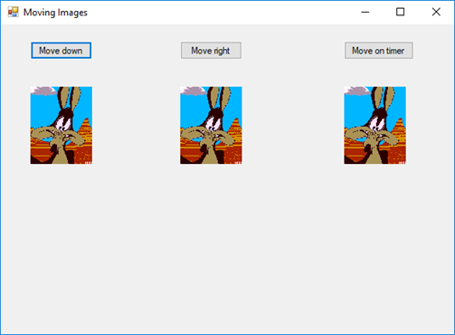
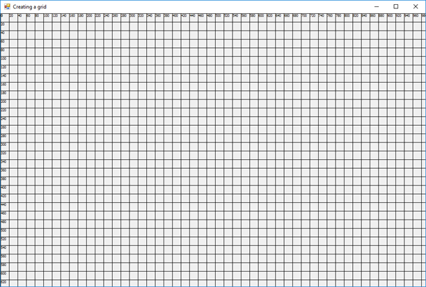
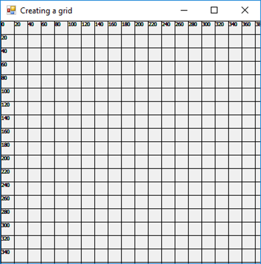
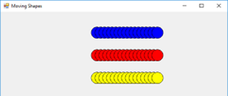
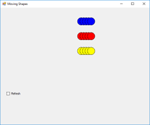
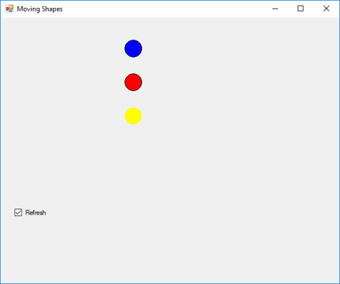
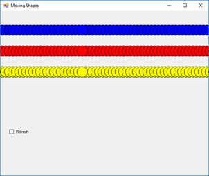

# 08: Timer Control, Graphics Class and SoundPlayer Class

## Timer Control

The `Timer` controls provides a way to execute code at specified intervals. It is commonly used in Windows Forms Apps to performs tasks such as updating the UI, refreshing data or executing specific code at regular intervals.

To use the `Timer` control, you must first drag it from the toolbox onto the form. Once you have done this, you can set properties such as `Interval` and `Enabled`. The `Timer` control exposes several events. The most commonly used event is the `Tick` event. This event is raised each time the `Interval` elapses.

## Graphics Class

The `Graphics` class provides methods for drawing shapes, text, images and other objects onto the form.

To get started, above the `Form1`'s constructor, declare a `Graphics` variable:

```csharp
private Graphics graphics;
```

In the `Form1`'s constructor, create a new instance of the `Graphics` class by calling the `CreateGraphics` method:

```csharp
public Form1()
{
    InitializeComponent();

    graphics = CreateGraphics();
}
```

Create a new `Form` event called `Paint`. In the `Form1_Paint` method, add the following:

```csharp
private void Form1_Paint(object sender, PaintEventArgs e)
{
    // Draw a line
    graphics.DrawLine(Pens.Red, new Point(10, 10), new Point(20, 20));

    // Draw a rectangle
    graphics.DrawRectangle(Pens.Blue, new Rectangle(10, 20, 100, 50));

    // Fill a rectangle with a colour
    graphics.FillRectangle(Brushes.Red, new Rectangle(10, 20, 100, 50));

    // Set the font
    Font font = new Font("Consolas", 55, FontStyle.Italic);

    // Draw text
    graphics.DrawString("Hello, World!", font, Brushes.SkyBlue, new Point(20, 45));
}
```

## SoundPlayer Class

The `SoundPlayer` class provides methods for playing sounds files. To get started, above the `Form1`'s constructor, declare a `SoundPlayer` variable:

```csharp
private SoundPlayer soundPlayer;
```

In the `Form1`'s constructor, create a new instance of the `SoundPlayer` class by calling the `SoundPlayer` constructor:

```csharp
public Form1()
{
    InitializeComponent();

    soundPlayer = new SoundPlayer(); // You can also pass a file path to the constructor
}
```

To play a sound, call the `Play()` method:

```csharp
soundPlayer.Play();
```

To stop a sound, call the `Stop()` method:

```csharp
soundPlayer.Stop();
```

# Formative Assessment

Before you start, create a new **C# Console** application called **08-formative-assessment**.

If you get stuck on any of the following tasks, feel free to use **ChatGPT** permitting, you are aware of the following:

- If you provide **ChatGPT** with a prompt that is not refined enough, it may generate a not-so-useful response
- Do not trust **ChatGPT's** responses blindly. You must still use your judgement and may need to do additional research to determine if the response is correct
- Acknowledge that you are using **ChatGPT**. In the **README.md** file, please include what prompt(s) you provided to **ChatGPT** and how you used the response(s) to help you with your work

## Task 1:

1. Start a new project.
2. Place three `PictureBox` controls on the form.
3. Place a `Button` directly above each `PictureBox`.



4. Write a `button1_Click` handler so that, when the `button1` is clicked, the first image moves 10 pixels down the page:

```csharp
pictureBox1.Top += 10;
```

5. When you have checked that this code works, rewrite the code using constants and the += operator. More about constants here - <https://learn.microsoft.com/en-us/dotnet/csharp/programming-guide/classes-and-structs/constants>.
6. Write a `button2_Click` handler so that, when the `button2` is clicked, the second image moves 10 pixels across the page.
7. Write a `button3_Click` handler so that, when the `button3` is clicked, a timer is enabled and the third image moves down and across the page, from top right corner to bottom left of the screen.
8. What other properties could you change?

## Task 2:

1. Create a new project.
2. On the form, draw a green cross, a red rectangle with a black border a yellow ellipse with a blue shadowing ellipse and the slogan "Hi there!" as shown below.


## Task 3:

1. Create a new project.
2. Most of your work with `Graphics` will involve thinking about your forms as a grid of (x, y) coordinates. Here is the skeleton to build the grid shown below. Fill in the missing parts.

```csharp
private void Form1_MouseClick(object sender, MouseEventArgs e)
{
    Font font = new Font("Tahoma", 6, FontStyle.Regular);

    for (int x = 0; x < Width; x += 20)
    {
        // Write your code here
    }

    for (int y = 0; y < Height; y += 20)
    {
        // Write your code here
    }
}
```



Note: You need to create the `Form1_MouseClick` event handler via the `Events` tab in the `Properties` window.

## Task 4:

1. What will be drawn when you run the code below? Notice that a curve is defined by an array of connected points.

```csharp
Pen pen = new Pen(Brushes.Black, 3.0F);
graphics.DrawCurve(pen, new Point[] { new Point(80, 60), new Point(200, 40), new Point(180, 60), new Point(300, 40) });
graphics.DrawCurve(pen, new Point[] { new Point(300, 180), new Point(180, 200), new Point(200, 180), new Point(80, 200) });
graphics.DrawLine(pen, new Point(300, 40), new Point(300, 180));
graphics.DrawLine(pen, new Point(80, 60), new Point(80, 200));
graphics.DrawEllipse(pen, 40, 40, 20, 20);
graphics.DrawRectangle(pen, 40, 60, 20, 300);
graphics.DrawLine(pen, new Point(60, 60), new Point(80, 60));
graphics.DrawLine(pen, new Point(60, 200), new Point(80, 200));
```

2. Draw the output on the grid.


## Task 5:

1. What will be drawn when you run the code below? Notice that a polygon is defined by an array of connected lines.

```csharp
graphics.FillPolygon(Brushes.Black, new Point[] { new Point(60, 40), new Point(140, 80), new Point(200, 40), new Point(300, 80), new Point(380, 60), new Point(340, 140), new Point(320, 180), new Point(380, 240), new Point (320, 300), new Point(340, 340), new Point(240, 320), new Point(180, 340), new Point(20, 320), new Point(60, 280), new Point(100, 240), new Point(40, 220), new Point(80, 160) });

Font font = new Font("Times New Roman", 24, FontStyle.Italic);

graphics.DrawString("Pow!", font, Brushes.White, new Point(80, 80));
graphics.DrawString("Pow!", font, Brushes.White, new Point(120, 120));
graphics.DrawString("Pow!", font, Brushes.White, new Point(160, 160));
graphics.DrawString("Pow!", font, Brushes.White, new Point(200, 200));
graphics.DrawString("Pow!", font, Brushes.White, new Point(240, 240));
```

2. Draw the output on the grid.

3. Could you rewrite the DrawString statements with a variable and a loop?



## Task 6:

1. Create a new project.
2. Write a `Timer1_tick` handler to draw three circles on the form. Use a different colour for each circle.
3. Place a `Timer` on the form. Modify your application so that, when the application starts, the figures are drawn automatically, and each 100 msec, the figures shift 20 pixels to the right. The example below shows the screen after several `Timer` cycles.



4. Add a `CheckBox` control to your form. As the application runs, the user can turn the screen refresh feature on and off by checking and unchecking this `CheckBox`.

When the `CheckBox` is checked, the screen refreshes.



When the `CheckBox` is unchecked, the screen does not refresh.



5. Modify your application so that when the drawings reach the right edge of the screen, they "wrap around" and come back in from the left edge.



# Formative Assessment Submission

Push your code to your **GitHub** repository.
