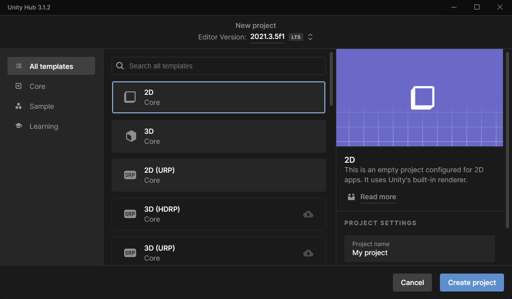
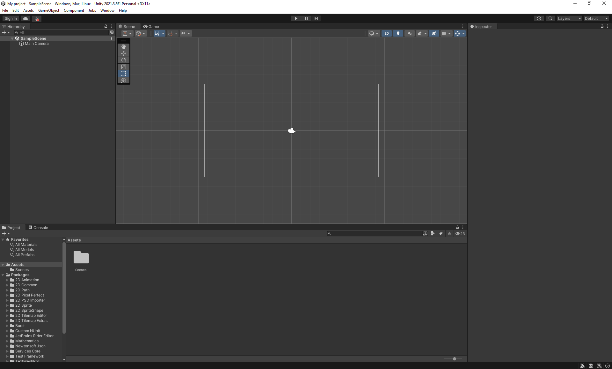
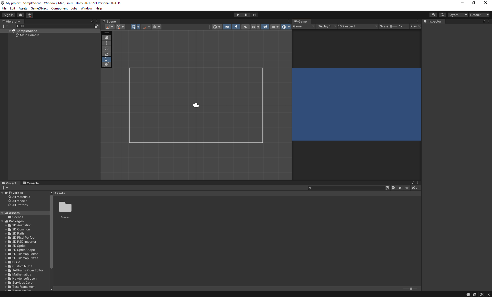
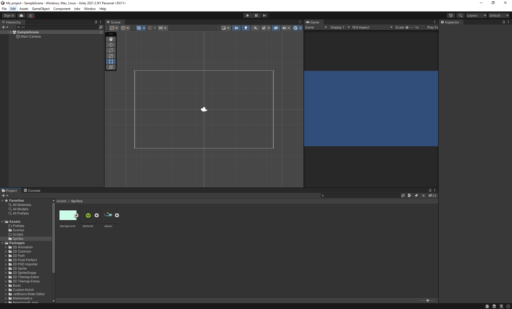
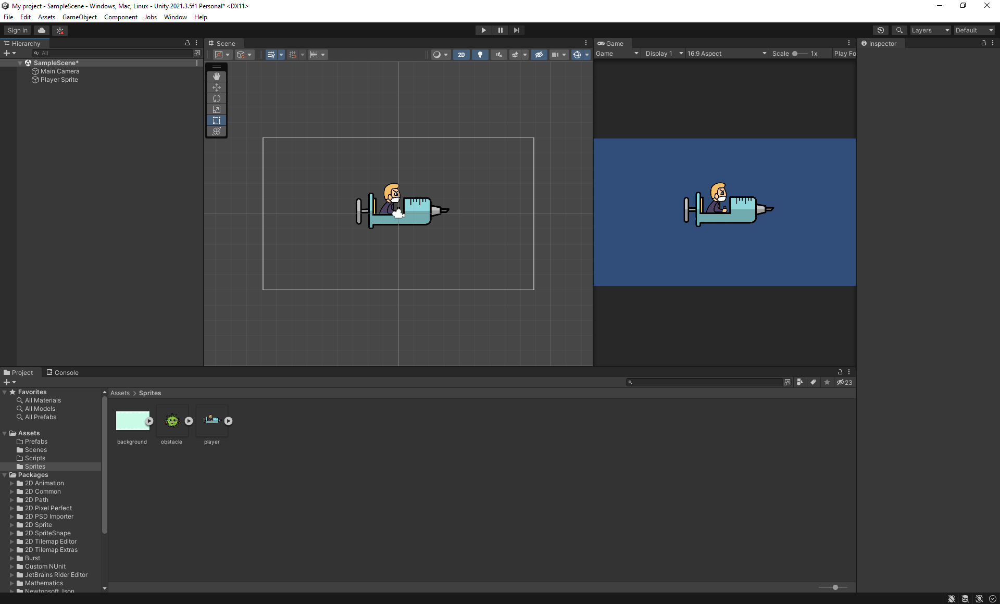
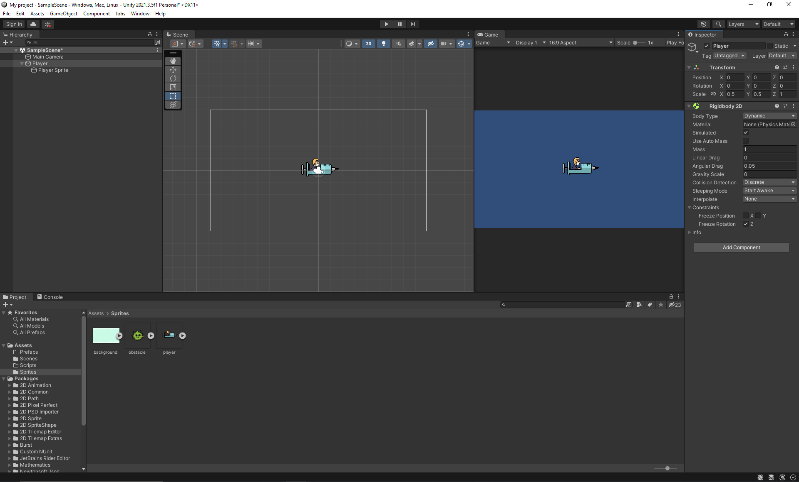
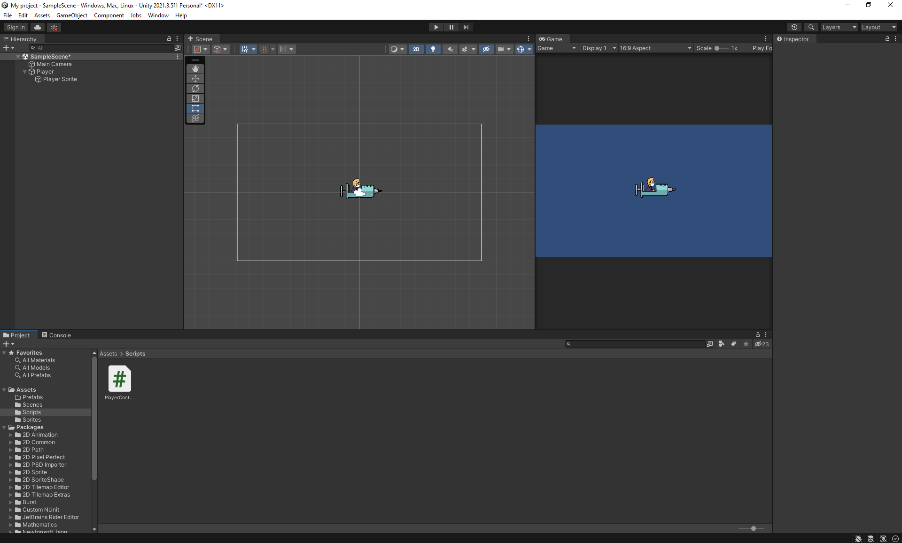

# Unity

## Overview

## Project Creation




## Project Configuration






## Asset Creation



## Player Controller








Please read the comments in the code snippet below:

```cs
using System.Collections;
using System.Collections.Generic;
using UnityEngine;

// ADD COMMENT
public class PlayerController : MonoBehaviour
{
    // ADD COMMENT
    public float speed;
    
    // ADD COMMENT
    private Rigidbody2D rb;
    
    // ADD COMMENT
    private Vector2 direction;

    // Start is called before the first frame update
    void Start()
    {
        // ADD COMMENT
        rb = GetComponent<Rigidbody2D>();
    }

    // Update is called once per frame
    void Update()
    {
        // ADD COMMENT
        float directionY = Input.GetAxisRaw("Vertical");
        
        // ADD COMMENT
        direction = new Vector2(0, directionY).normalized;
    }

    // ADD COMMENT
    void FixedUpdate() 
    {
        // ADD COMMENT
        rb.velocity = new Vector2(0, direction.y * speed);
    }
}
```


## Camera Movement

## Game Loop

## Obstacles

## Box Colliders

## Destroying Obstacles

## Formative Assessment

## Additional Tasks

### Game Over

### Scoring System

### Background Sound
